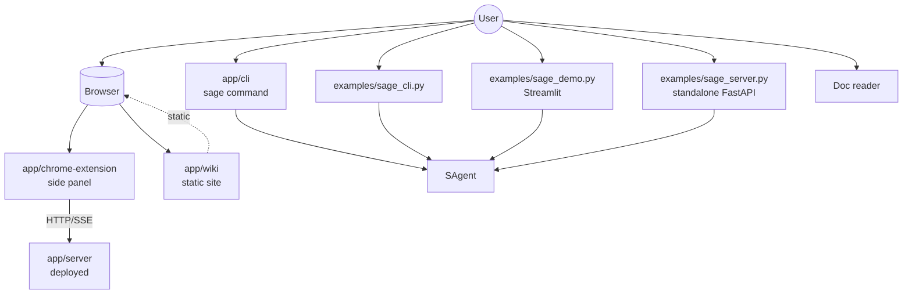
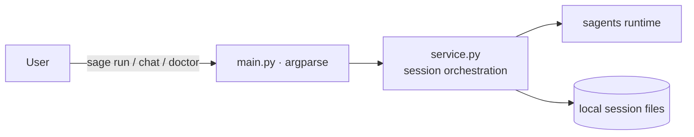
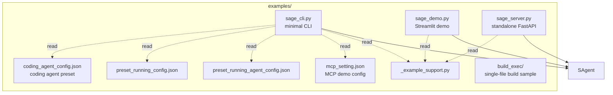
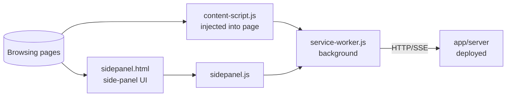
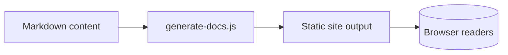
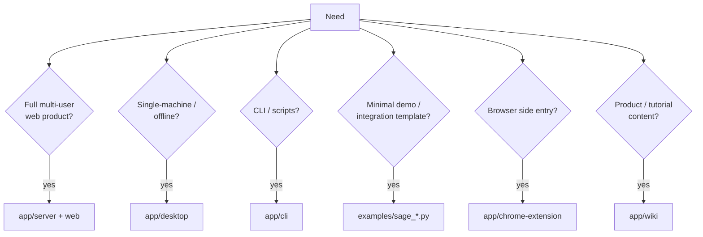



# CLI, Examples & External Entries

Beyond the two productized shapes (`app/server/` and `app/desktop/`), Sage ships several lighter entries for different scenarios: dev iteration, minimal demos, third-party integrations, docs/wiki.

## Entry Map

## CLI: `app/cli/`

Properties:

- Reuses `sagents/` directly without `app/server/`.
- Suitable for local dev, prompt iteration, runtime diagnostics.
- `sage doctor` checks environment (deps, model connectivity, sandbox).

See [CLI Guide](../applications/CLI.md) for commands.

## Examples: `examples/`

When to use:

- Validate the minimal arg set required to drive sagents.
- Build a quick standalone demo without the full server.
- Use as a baseline PyInstaller build sample.

When not to use: anything requiring full product features (multi-user, KB, observability UI) — go with `app/server/`.

## Chrome Extension: `app/chrome-extension/`

It does not embed sagents; it is a browser-side UI client that talks to a deployed `app/server/` over HTTP/SSE — effectively a "web client living in the side panel".

## Wiki / Static Docs: `app/wiki/`

`app/wiki/` is an internal product/operations wiki site. It has a different purpose from this `docs/` set:

- `docs/` (what you are reading): technical docs, bound to the current code.
- `app/wiki/`: business / product / tutorial content, can be hosted independently.

It is not part of the runtime, but it is one of the apps in the repo, so it lives in this chapter.

## Picking the Right Entry

