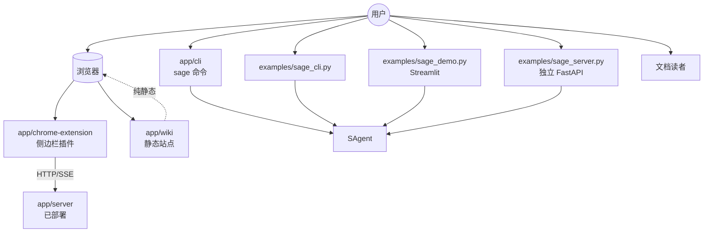
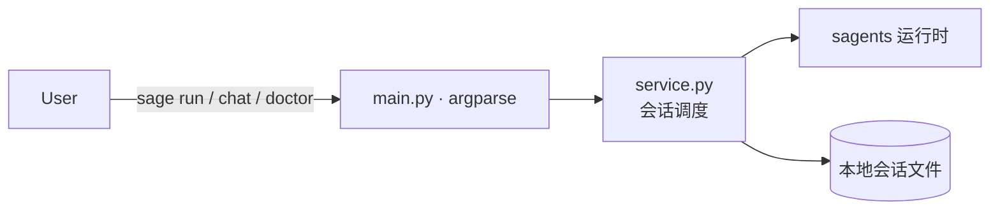
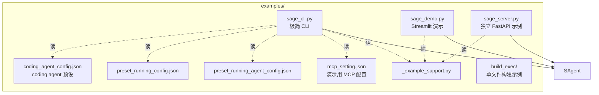
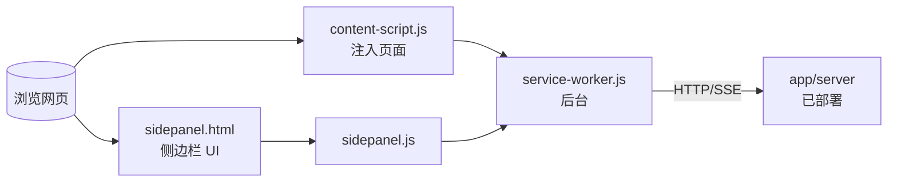
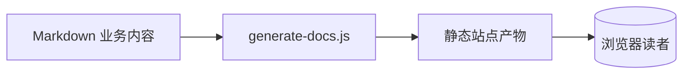
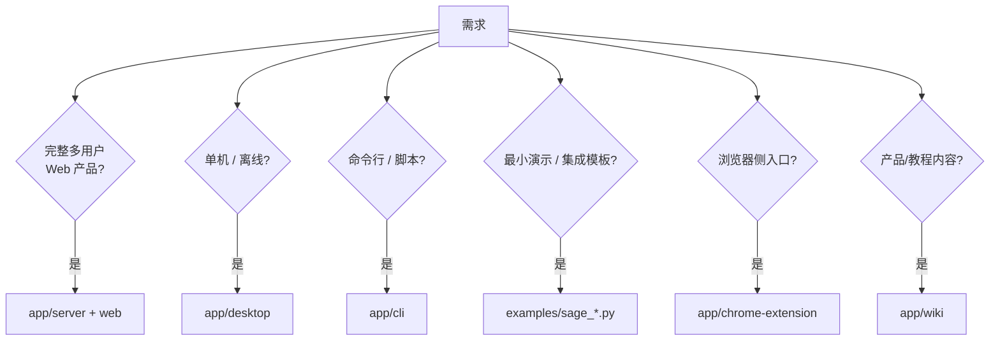



# CLI、示例与外部入口架构

除了 `app/server/` 和 `app/desktop/` 这两个完整产品形态外，Sage 还提供若干更轻量的入口，分别面向不同场景：开发调试、最小演示、第三方集成、文档/Wiki。

## 入口全景

## CLI：`app/cli/`

特点：

- 直接复用 `sagents/` 运行时，不依赖 `app/server/`。
- 适合本地开发、提示词迭代、运行时诊断。
- `sage doctor` 用于排查环境问题（依赖、模型连通性、沙箱）。

详细命令请见 [CLI 使用指南](../applications/CLI.md)。

## Examples：`examples/`

什么时候用：

- 验证“最少需要哪些参数才能跑通 sagents”。
- 快速做一个不依赖完整服务端的演示。
- 需要一个最小 PyInstaller 构建样本。

什么时候不用：要做完整产品功能（多用户、知识库、可观测性 UI），请用 `app/server/` 而不是 `examples/`。

## Chrome 扩展：`app/chrome-extension/`

它本身不嵌入 sagents 运行时，而是作为浏览器侧的 UI 客户端，通过 HTTP/SSE 调用部署在某处的 `app/server/`。等价于一个“住在浏览器侧边栏里的 Web 客户端”。

## Wiki / 静态文档：`app/wiki/`

`app/wiki/` 是面向产品/运营的内部 Wiki 站点，与本套 `docs/` 的定位不同：

- `docs/`（你正在看的）：技术文档，绑定当前代码库。
- `app/wiki/`：业务/产品/教程类内容，可独立出站。

它不参与运行时，但属于仓库中的“应用”之一，所以放在这一章。

## 总结：什么时候选哪种入口

